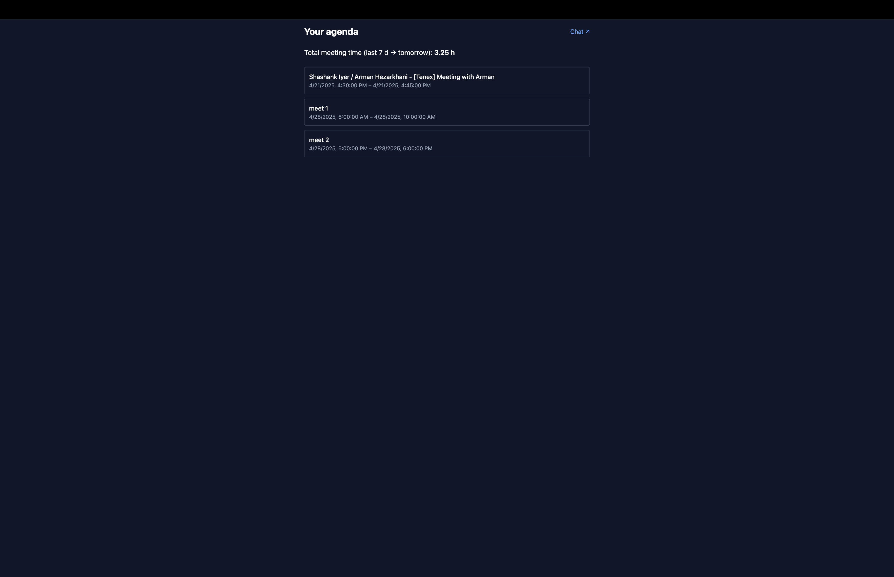
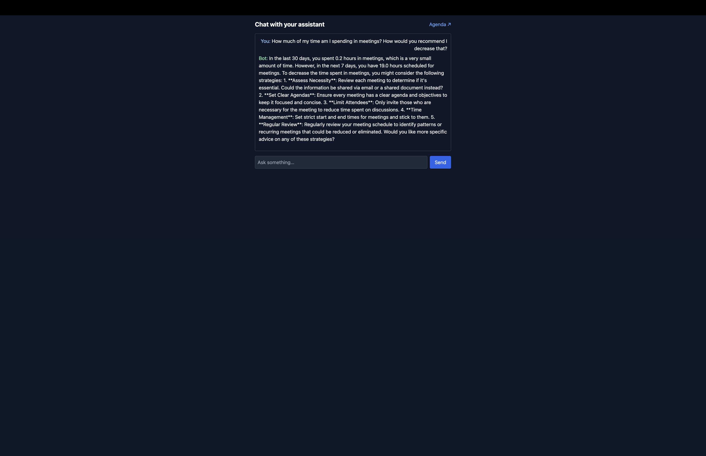

# Calendar Assistant 🗓️🤖

A full-stack prototype that lets you

1. **Sign in with Google**
2. View your recent Google Calendar events & total meeting hours
3. Chat with an OpenAI-powered assistant about your schedule  
   *(e.g. “How many hours of meetings next week?” or “Draft an email to cancel Friday’s call.”)*

<p align="center">
  
  
</p>

---

## Tech stack

| Layer      | Stack |
|------------|-------|
| Back-end   | **Python 3.11**, FastAPI, Google API Python Client, OpenAI SDK |
| Front-end  | **React + Vite + TypeScript**, Tailwind CSS, React Query, Axios, React Router |
| Auth       | Google OAuth 2 (installed-app pattern) |
| LLM agent  | OpenAI **gpt-4o** (configurable via `.env`) |

---

## Quick-start (local)

> **Prerequisites**  
> • Node 18+ and **pnpm** (or npm/yarn)  
> • Python 3.11+  
> • A Google Cloud project (OAuth)  
> • An OpenAI account/key

### 1  Clone & install

```bash
git clone https://github.com/your-org/calendar-assistant.git
cd calendar-assistant
pnpm install      # installs both workspaces
```

### 2 Environment variables

```bash
cp .env.example .env   # then edit .env

Key | Description
OPENAI_API_KEY | your OpenAI key
GOOGLE_CLIENT_ID | OAuth 2.0 Client ID (Web)
GOOGLE_CLIENT_SECRET | OAuth 2.0 Client secret
GOOGLE_REDIRECT | http://localhost:8000/auth/callback
```


### 3  Google Cloud setup

1. Open **APIs & Services → Credentials → Create credential → OAuth client ID**  
2. Select **Application type → Web application**  
3. Add the following **Authorized redirect URI**

     `http://localhost:8000/auth/callback`


4. Click **Create** and copy the Client ID & secret into your `.env`.  
5. Keep the consent screen in **Testing** mode.  
Everyone who will run the app **must be listed under “Audience -> Test users.”**


---

### 4  Run

```bash
# ─ back-end
uvicorn app.main:app --reload        # → http://localhost:8000/docs

# ─ front-end (new terminal)
pnpm dev                # → http://localhost:5173
```

Open http://localhost:5173/login

Click Sign in with Google → approve consent → you’ll land on /agenda

Click Chat ↗ to converse with the assistant.